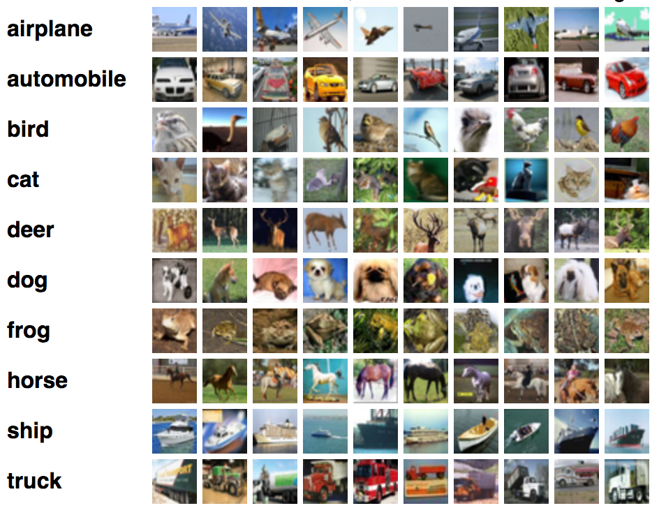

# LeNet-5-for-CIFAR10-Data-classification

This is a LeNet5 architecture based CNN model to classify CIFAR10 dataset. Pytorch library has been used to implement neural network.  

### About Dataset 
The CIFAR-10 dataset contains 60,000 32x32 color images in 10 different classes. The 10 different classes represent airplanes, cars, birds, cats, deer, dogs, frogs, horses, ships, and trucks. There are 6,000 images of each class. Training set contains 50,000 images with 5,000 images from each class and testing set contains 10,000 images from each class. 
  

### About LeNet-5 architecture
The LeNet-5 architecture consists of two sets of convolutional and average pooling layers, followed by a flattening convolutional layer, then two fully-connected layers and finally a softmax classifier. 

First layer: 
The input for LeNet-5 is a 32×32 RGB image which passes through the first convolutional layer with 6 feature maps or filters having size 5×5 and a stride of one. The image dimensions changes from 32x32x3 to 28x28x6. 
Second layer: 
Then the LeNet-5 applies average pooling layer or sub-sampling layer with a filter size 2×2 and a stride of two. The resulting image dimensions will be reduced to 14x14x6. 
Third layer: 
Next, there is a second convolutional layer with 16 feature maps having size 5×5 and a stride of 1. 
Fourth layer: 
The fourth layer (S4) is again an average pooling layer with filter size 2×2 and a stride of 2. This layer is the same as the second layer (S2) except it has 16 feature maps so the output will be reduced to 5x5x16. 
Fifth layer: 
The fifth layer (C5) is a fully connected convolutional layer with 120 feature maps each of size 1×1. Each of the 120 units in C5 is connected to all the 400 nodes (5x5x16) in the fourth layer S4.  
Sixth layer: 
The sixth layer is a fully connected layer (F6) with 84 units. 
Output layer: 
Finally, there is a fully connected softmax output layer ŷ with 10 possible values corresponding to the 10 different classes.  

### Training and Tesing
